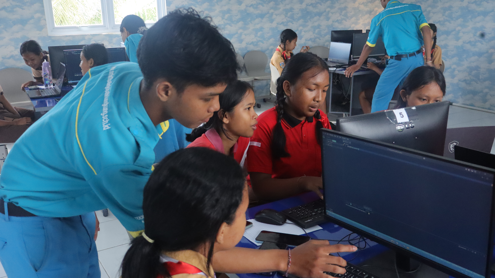
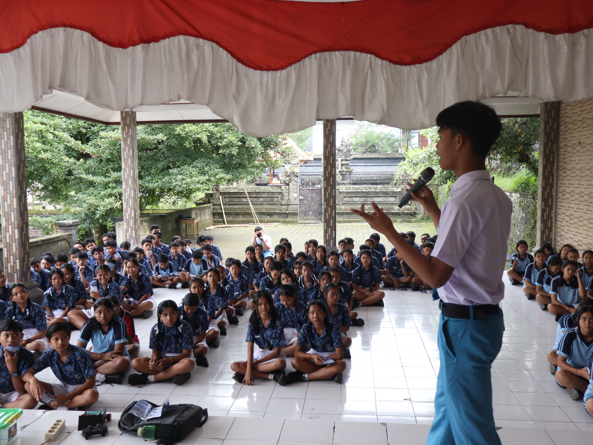

# 👋 Hi everyone! I'm Mahayana, a Public Speaker passionate about Software Engineering and technology.

<!--
**igedemahayana/igedemahayana** is a ✨ _special_ ✨ repository because its `README.md` (this file) appears on your GitHub profile.

Here are some ideas to get you started:

- 🔭 I’m currently working on ...
- 🌱 I’m currently learning ...
- 👯 I’m looking to collaborate on ...
- 🤔 I’m looking for help with ...
- 💬 Ask me about ...
- 📫 How to reach me: ...
- 😄 Pronouns: ...
- ⚡ Fun fact: ...
-->

  
  

🙋 **I'm the Founder & Owner of Youtube** [**Myanaa**](https://www.youtube.com/@Myanaa_)  
🙋 **I'm also the Founder & Owner of** [**myatech.id**](https://www.tiktok.com/@myatech.id)  
💻 **Currently, I serve as the Lead of** [**Code Globaliti Developer**](https://www.instagram.com/code.globalitiklk)  

## Organizations

📰 **Journalistic & Public Speaking** — Lead  
💻 **Code Globaliti Developer** — Lead

## Tools Skilss

## Language & Frameworks

## Achievements

<ul>
  <li>🥈 2nd Place – Web Design Tech Fest INSTIKI Competition</li>
  <li>🥈 2nd Place – Web Programming Competition (180 Menit), PARAX ICT XI INSTIKI</li>
  <li>🥈 2nd Place – AI Exhibition Category, Lomba Kompetensi Nasional (LKS)</li>
  <li>🥇 1st Rank – Grade 11 Software Engineering (RPL)</li>
  <li>🥈 2nd Rank – Grade 10 Software Engineering (RPL)</li>
  <li>🎖️ 6th Place – FASTEKNO ITB Stikom Bali Web Design Competition 2026</li>
</ul>

## Competitions & Participation

<ul>
  <li>Participant – I/O Fest 2026 FTI UNTAR Web Development Competition (Nasional)</li>
  <li>Participant – SEFEST 2026 Himpunan Mahasiswa Software Engineering Telkom University (Nasional)</li>
  <li>Participant – INVOFEST 2026 Teknik Informatika Universitas Harkat Negeri (Nasional)</li>
  <li>Participant – Techtopia 2025 Web Design Competition HMJTI Undiksha (Nasional)</li>
</ul>

## Connect with me

